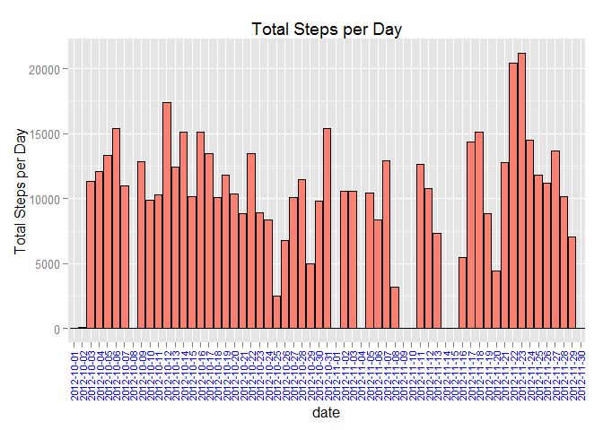

##Loading and preprocessing the data

1. Load the data


```r
if (!file.exists("assignment1")){
  dir.create("assignment1")
}
setwd("assignment1")
setInternet2(use = TRUE)
URL <- "https://d396qusza40orc.cloudfront.net/repdata%2Fdata%2Factivity.zip"
suppressWarnings(download.file(URL,destfile="activity.zip"))
unzip("activity.zip")
actdata <-read.csv("activity.csv")
```

2. Process/transform the data (if necessary) into a format suitable for your analysis

**dplyr** is being used to format the data for the analysis making use of group_by function   


```r
suppressWarnings(library("dplyr"))
```

```
## 
## Attaching package: 'dplyr'
## 
## The following object is masked from 'package:stats':
## 
##     filter
## 
## The following objects are masked from 'package:base':
## 
##     intersect, setdiff, setequal, union
```

```r
actdata1 <- tbl_df(actdata)
library("ggplot2")
dt <- actdata1 %>%
  group_by(date) %>%
  summarize(sum_steps_daily = sum(steps, na.rm=TRUE))
```

##What is mean total number of steps taken per day?

1. Make a histogram of the total number of steps taken each day

ggplot is used to plot the histogram for the total steps per day  


```r
g <- ggplot(dt, aes(x=date, y=sum_steps_daily))
g + geom_histogram(stat="identity", color="black", fill="salmon") +
    ylab("Total Steps per Day") +
    labs(title="Total Steps per Day")+
    theme(axis.text.x=element_text(angle=90,hjust=1, vjust=0.5, color="blue", size=8))
```

 

2. Calculate and report the **mean** and **median total** number of steps taken per day


```r
mean(dt$sum_steps_daily)
```

```
## [1] 9354.23
```

```r
median(dt$sum_steps_daily)
```

```
## [1] 10395
```

##What is the average daily activity pattern?

1. Average number of steps by 5 minute interval

**group_by** on interval to calculate the average number of steps by interval and then plot average steps over the intervals  


```r
int <- actdata1 %>%
    group_by(interval) %>%
    summarize(avg_steps_inter = mean(steps, na.rm=TRUE))

g <- ggplot(int, aes(x=interval, y=avg_steps_inter))
g + geom_line()
```

 

2. 5 minute interval having maximum steps


```r
int %>% arrange(desc(avg_steps_inter)) %>% filter(row_number()==1)
```

```
## Source: local data frame [1 x 2]
## 
##   interval avg_steps_inter
## 1      835        206.1698
```

##Imputing missing values

1. Calculate and report the total number of missing values in the dataset


```r
actdata1 %>% filter(!complete.cases(steps))%>% summarise(n())
```

```
## Source: local data frame [1 x 1]
## 
##    n()
## 1 2304
```

2. Devise a strategy for filling in all of the missing values in the dataset. The strategy does not need to be sophisticated. For example, you could use the mean/median for that day, or the mean for that 5-minute interval, etc.


Using the 5 minute interval average for the intervals with missing values.


```r
temp_steps <- integer(0)

for(i in 1:nrow(actdata1)){
    if (is.na(actdata1[i,c("steps")])){
        s <- filter(int, interval==(as.numeric(actdata1[i,c("interval")]))) %>% select(avg_steps_inter)
        temp_steps <- rbind(temp_steps,(as.integer(round(as.numeric(s)))))
    }else{
        temp_steps <- rbind(temp_steps,(as.integer(actdata1[i,c("steps")]) ))
    }
        
}
```

3. Create a new dataset that is equal to the original dataset but with the missing data filled in.

Using the vector created above, creata a new data frame for dplyr


```r
actdata2 <- tbl_df(data.frame(steps=temp_steps, date=actdata1$date, interval=actdata1$interval))
```

4. Make a histogram of the total number of steps taken each day and Calculate and report the mean and median total number of steps taken per day. Do these values differ from the estimates from the first part of the assignment? What is the impact of imputing missing data on the estimates of the total daily number of steps?


```r
dt2 <- actdata2 %>%
  group_by(date) %>%
  summarize(sum_steps_daily = sum(steps, na.rm=TRUE))

g <- ggplot(dt2, aes(x=date, y=sum_steps_daily))
g + geom_histogram(stat="identity", color="black", fill="salmon") +
    ylab("Total Steps per Day") +
    labs(title="Total Steps per Day")+
    theme(axis.text.x=element_text(angle=90,hjust=1, vjust=0.5, color="blue", size=8))
```

 

The total number of steps per days has increased after inputting the missing data.

**Mean:**

```r
mean(dt2$sum_steps_daily)
```

```
## [1] 10765.64
```

**Median:**

```r
median(dt2$sum_steps_daily)
```

```
## [1] 10762
```


## Are there differences in activity patterns between weekdays and weekends?

1. Create a new factor variable in the dataset with two levels -- "weekday" and "weekend" indicating whether a given date is a weekday or weekend day.


```r
temp_day <- character()

for(i in 1:nrow(actdata2)){
dy <- weekdays(as.Date(actdata2[i,c("date")]$date))
  if (dy %in% c("Monday","Tuesday","Wednesday","Thursday","Friday")){
  temp_day <- rbind(temp_day,"weekday")
  }else{
  temp_day <- rbind(temp_day,"weekend")
  }
}

actdata3 <- tbl_df(data.frame(steps=actdata2$steps, date=actdata2$date, interval=actdata2$interval, wday =factor(temp_day) ))
```


2. Make a panel plot containing a time series plot (i.e. type = "l") of the 5-minute interval (x-axis) and the average number of steps taken, averaged across all weekday days or weekend days (y-axis). The plot should look something like the following, which was created using simulated data:


```r
dt3 <- actdata3 %>%
  group_by(wday,interval) %>%
  summarize(avg_steps_wday = mean(steps, na.rm=TRUE))

library(lattice)
xyplot(avg_steps_wday~interval|wday, data=data.frame(dt3), layout=c(1,2),type="l")
```

 

There is more activity on weekends as compared to weekdays

